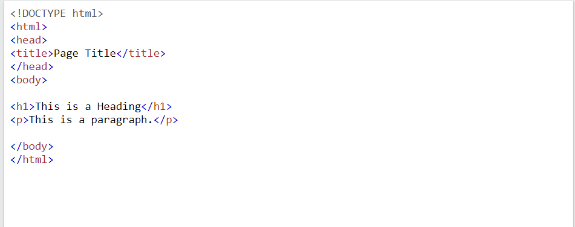
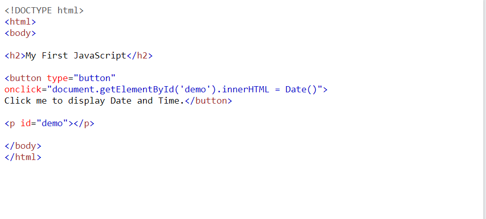

# **Introductory HTML and JavaScript**

## *HTML*

| What?| Why?| How?|
|--------|-------|-------:|
| HyperText Markup Language|Structure of webpages and add content and info to webpages |Using tags that wrap the content and tell the browser the type of the content|

### *There are general tips and steps to write a html code, first to tell the browser what version of html we use we type DOCTYPE html at the top of the code, then we write any information about the page within the <head> tags, and all the other content within the <body> tags. Attributes appear in the opening tag and they have a name and a value.*

### *In html there are two types of elements:*

- *Block elements: always appear to start on a new line (<h1>, 
, <ul>, <li>)*

- *In-line elements: (<em>, <b>, </b>)*

- An example of HTML:

## **JavaScript**

| What?| Why?| How?|
|--------|-------|-------:|
| It is an interpreted programming language uses math and logic.|To make the webpage interactive with the users logic |We can write javascript code in the same html file using <script> tags. or we can create a new file with .js extension to write the javasript code inside it and add the link to the html file using <script src=""> tag.|

- An example of JavaScript:

## *ABC programming*
 **A**:
 The script is a series of instructions that the computer can follow in order to achieve a goal, to approach writing a script we need to think like a computer "programmatically".

 **B** :

 In computer programming, each physical thing in the world can be represented as an object, each object has its own:

Properties
Events
Methods
Example for real objects:

Object: car

Properties: color, fuel, make

Events: brake, accelerate

Method: change speed

Computers use data to create models of things in the real world. The events, methods, and properties of an object all relate to each other: Events can trigger methods, and methods can retrieve or update an object's properties.

**C**:

As I mentioned before, there are two ways to write a script, but is it best to keep JavaScript code in its own JavaScript text file with the extension .js and use the <script> element in html pages to tell the browser to load JavaScript file.
