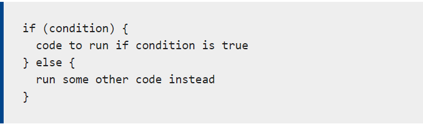

# **Text**
+  *HTML has a six levels of headings:*
     1. h1 : the most important one and the largest one.
     2. h6: the least important one and the smallest.

+ There are a lot of tags that we'll use it in HTML and here is some examples of tags that we will use:
   1. 
 to insert a paragraph
   2. to make the text bold and italic use these tags respectively <b> <i>
   3. <blockquote> to quote a sentence or any text.
   4. to add some information about the author of the code use <address>

# **CSS**
*CSS : stands for Cascading Style Sheet, also used to give our website a good-looking*

CSS types:
+ Inline CSS
+ External CSS
+ Internal CSS

There are rules that made up of selectors and declaration.
Declarations are made up of two parts :
 1. The properities of the element
 2. Values of the properities

# **JavaScript instructions**
- script: made up a series of statements.
- We'll use variables and we must assign values to each variable

## JavaScript data types:
   1. String anything between single quotation
   2. Number
   3. Boolean (True/False)

# **Decisions and loops**
Example for decision

types of loops:
for loop : repeat the code for limited amount of time
while loop: repeat the code for unlimited amount of time until the loop is broken

