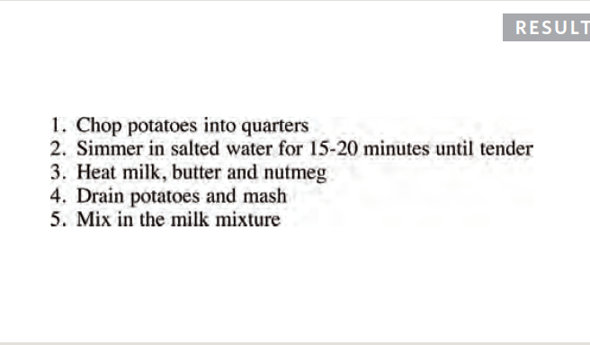
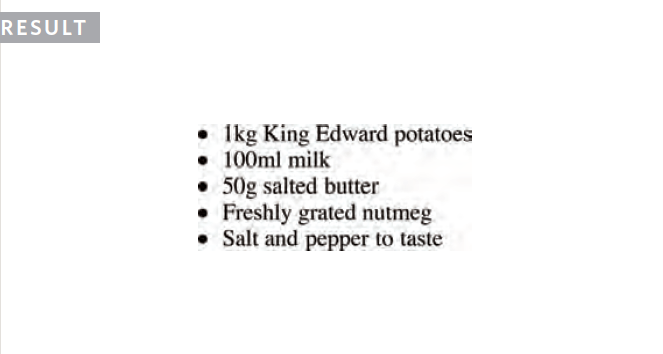
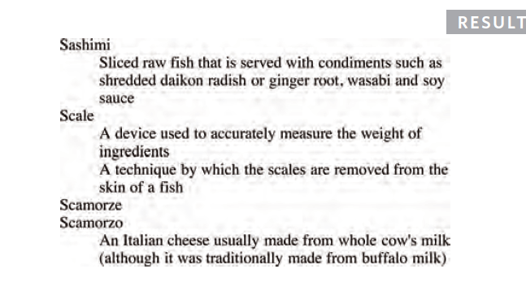
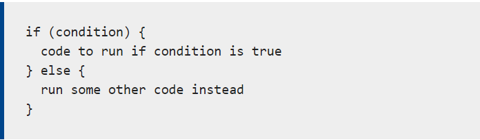

# **Lists in HTML:**
## *Types of lists:
  
  - Ordered list: each item in it is numbered like when you write a set of steps for a recipe

   

  - Unordered list: lists that began with bullet point.

    

 - Definition list: to contain the term being defined

    

 - Nested list

# **Boxes**

 - Css consider every element in HTML as one box.
 - You can use css to :
     - Control Dimensions
     - Control Borders
     - Margin
     - Padding

# **JavaScript instructions**
- script: made up a series of statements.
- We'll use variables and we must assign values to each variable

## JavaScript data types:
   1. String anything between single quotation
   2. Number
   3. Boolean (True/False)

# **Decisions and loops**
Example for decision

types of loops:
 - for loop : repeat the code for limited amount of time

 - while loop: repeat the code for unlimited amount of time until the loop is broken