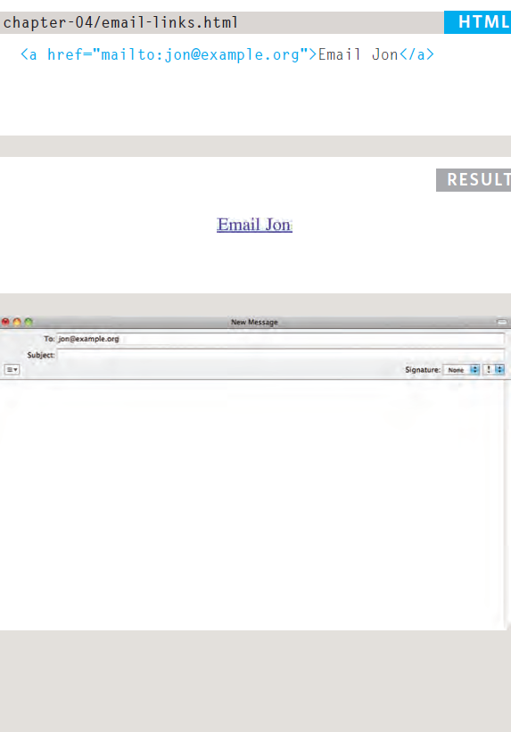
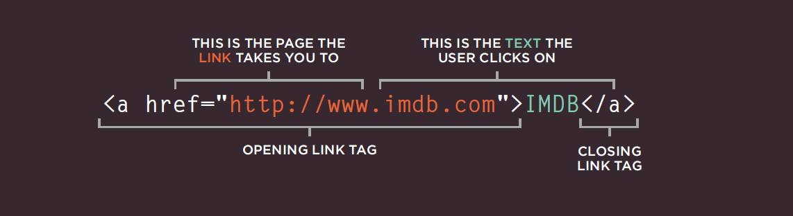
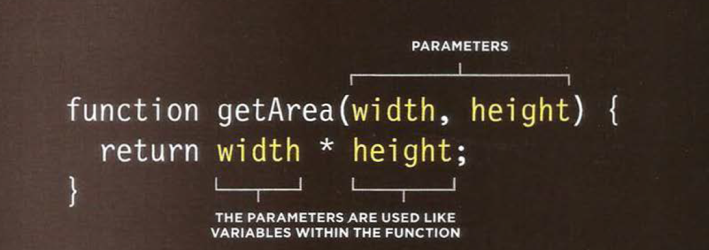

# **Links**
*Links allow you to move from webpage to another*
- Types of links:
  
   1. Link websites
   2. Link pages in same website
   3. link parts in pages with each other
   4. Email links
     
   5. Opening links in a new window
   

- We use this tag to link 
  

# **Layout**
- How to control each elment sits on a page and how to create attractive page layouts.

- Types of elments:
  
    1. Block-elment:
       - example :
          h1,p,ul,li

    2. Inline elments
       - example:
          img,b,i,span

    3. Containing elments
      -example:
         div

# **Functions, methods, and objects.**

- Functions: series of statements that have been grouped together because they perform a *SPECIFIC* task, functions act like a store.
  

- Methods: same as function, but they're created inside an object.

# **Pair programming**
 
is a technique common to many agile work environment.

-Pair programming invloves two roles:
 1. Driver: the programmer who is typing, driver manages text-editor, switching files, version control
 2. Navigator: guides the driver

* Why do we use pair programming?
  
   1. Greater efficiency
   2. Engaged collabration
   3. Learning from fellow students
   4. Social skills
   5. Job interview readiness
   6. Work environment readiness