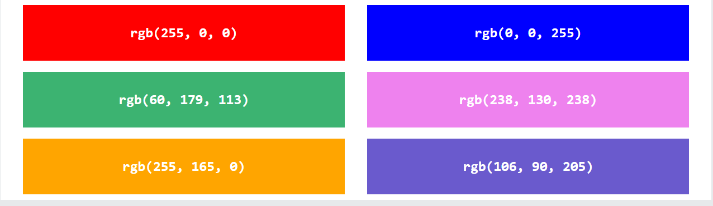
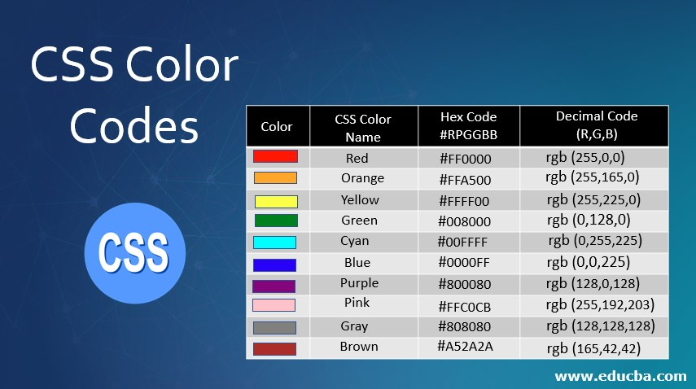

# **Images**
 
 Why we use images?
  to insert:

    1. Logo
    2. photograph
    3. illustration
    4. diagram
    5. chart

* We use tag called img to add image, also we use attributes like *src* and *alt to describe the content of an image*

* Images format:
     1. JPEG: used with all images that contain a natural scene/photograph
     2. PNG: used with any image that needs transparency and images with text
     3. GIF: used with images contain animation 

# **Colors**
  
  * Color can bring your page to life 

  * 3 ways to describe colors:
      * RGB values
    
         

      * Hex codes
      * 
           

      * color names

# **Text**
 
 * allows you to control the appearence of the text
 * It can be splitted into 2 groups:
     1. Directly affect the font and it's appearence
     2. have the same effect on text

