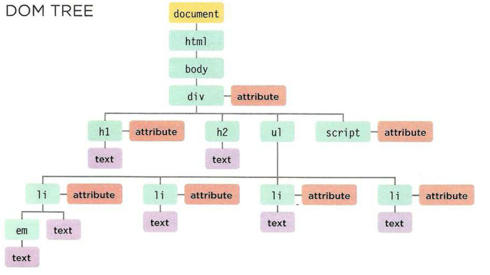

# **Object literals**
  - Object: group together a set of variables and functions to create a model of a something you would recognize from the real world.

- In an object variables known as properities such as :
    1. Name of a hotel.
    2. Number of rooms.

    - example for a properities:
      
         

  
- In an object functions become known as method like:
    - Checking how many rooms availabe (Total rooms - reserved rooms)
    - Example:
     

- Properities and methods have a name and key.
- Object cannot have two keys with the same name.
- value of property can be:
   1. String.
   2. Number.
   3. Boolean.
   4. Array.
   5. Another object.
   
- Value of method is always a function.

# **DOM**
*Is the Document Object Model*
- Specifies how browsers should create a model of an HTML page and how JavaScript can access and update the contents of a webpage while it is in the browser window.
  
- When the browser loads a webpage it creates a model of the page in **Memory**
  
- DOM specifies the way in which the browser should structure this model using *DOM tree*

    

- There is another calling for DOM which is **Application Programming Interface(API)**  it lets the people interact with the program.