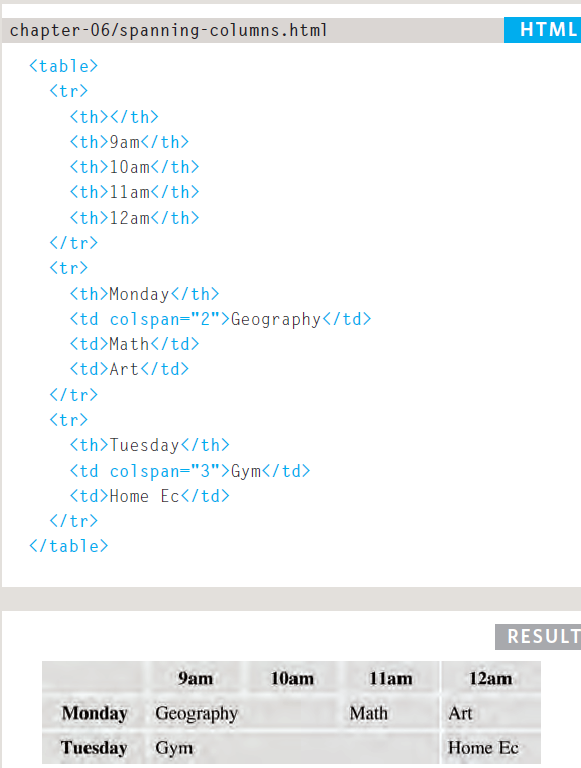

# **Tables**

- There are many types of inputs that needs to be stored in a grid or table.
    - Example:
       1. Sports 
       2. Results
       3. Stock reports
       4. Train timetables

* Use table tag to represent tablein *html*
* Use tr tag to represent a raw
* Use td tag to represent the data of the table
* Use th tag to represent table heading

- Example for table:
   

# **Function and Object**
  
  * Web browser excutes object that has browser window and document loaded into the browser window.
  * JavaScript has many built-in object(these helps you write scripts)
    - example:
       1. String
       2. Number
       3. Math
   
  * Arrays and objects can be used to create complex data