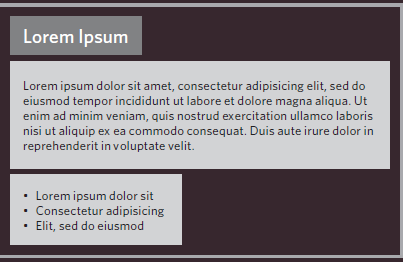
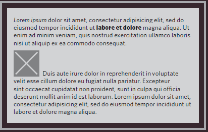
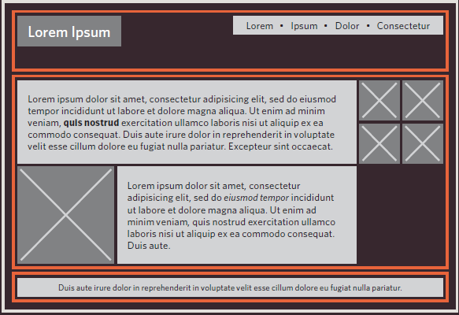

# **Layout**
- How to control each elment sits on a page and how to create attractive page layouts.

- Types of elments:
  
    1. Block-elment:
       
       - example :
          h1,p,ul,li

    2. Inline elments
       
       - example:
          img,b,i,span

    3. Containing elments
      
      -example:
         div

**Normal flow**
1. Position :static.
2. Position:relative.
3. Position: absolute.
4. Fix.