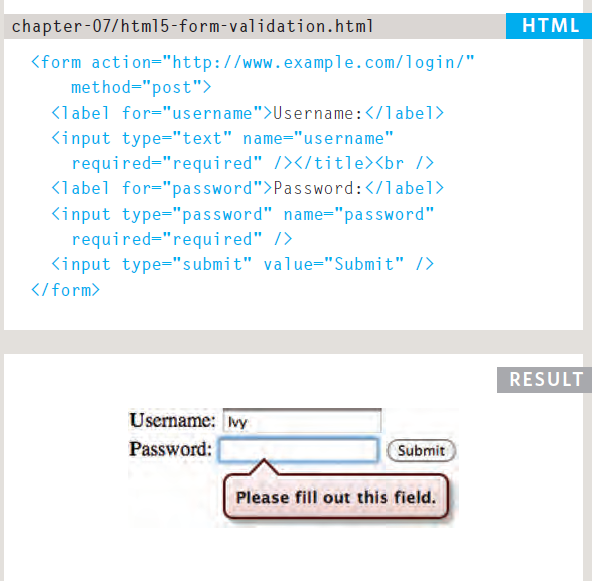

# **Lists,Tables and Forms**

## **Forms**

- *Whenever you want to c XX ollect information from
visitors you will need a form, which lives inside a
form tag element.*

- *Information from a form is sent in name/value pairs.
XX Each form control is given a name, and the text the
user types in or the values of the options they select
are sent to the server.*

- *HTML5 introduces new form elements which make it
easier for visitors to fill in forms.*

## **Lists,tables and forms**

- *List markers can be given different appearances
using the list-style-type and list-style image
properties.*

- *Table cells can have different borders and spacing in
different browsers, but there are properties you can
use to control them and make them more consistent.*

- *Forms are easier to use if the form controls are
vertically aligned using CSS.*
- *Forms benefit from styles that make them feel more
interactive.*

# **Events**

*Scripts often respond to these events by updating the content of the web page (via the
Document Object Model) which makes the page feel more interactive.*
