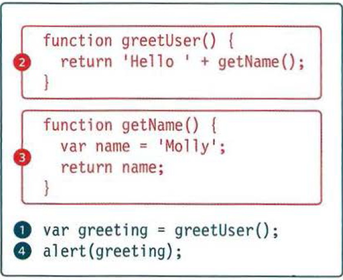
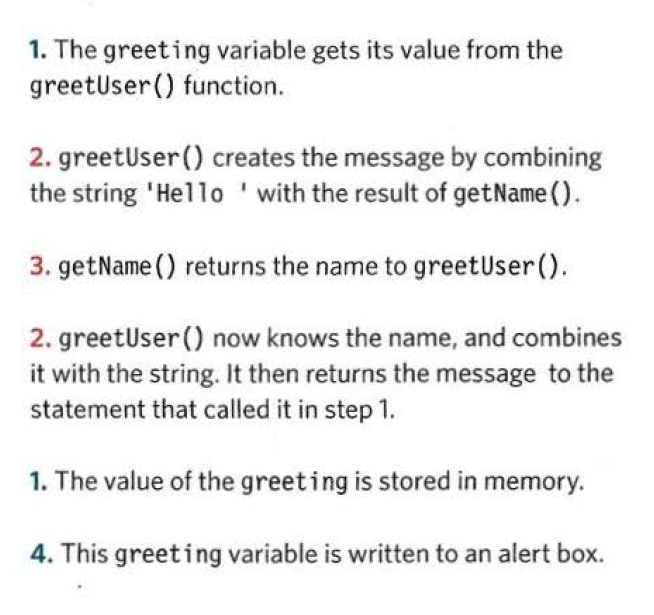

# **ERROR HANDLING AND DEBUGGING**

- *Every developer faced a problems or made a mistake while coding no one writes the **JavaScript** perfectly from first time

- The console and dev tools: built into browsers to help devs find the error.

- Common problems and how to fix them

## **Order of excution :**

## **Debugging workflow**
1. Where is the problem?
   
    1. Look at the error message, it tells you the script that causes the problem, the line number and the type of error.
    2. Check how far the script is running
    3. Use breakpoints where things are going wrong.
   

2. What is the problem?
    1. When setting breakpoints see if the variables around them have the values you expect.
    2. Break down parts of the code to test smaller pieces
    3. Check the number of parameter for a function

* You can handle your error using the **TRY** , **CATCH** , **FINALLY** statements.