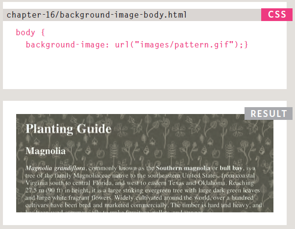
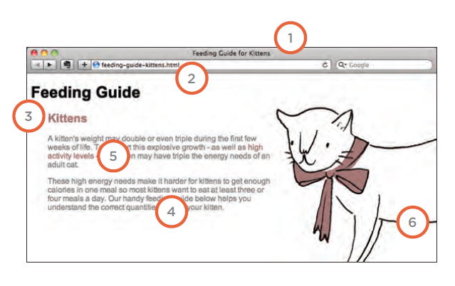
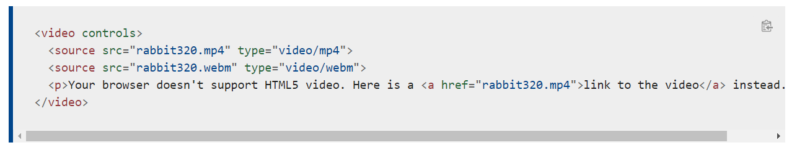

# **Images**
- You can control the size of an image using the width and height in CSS.
- Images can be aligned with both horizontally and vertically using CSS.
- you can use a background images using :
    

- To reduce the number of images your browser has to load you can create image sprits.

# **Practical Information**
 - Search Engine Optimization(SEO): *Helping your site appear nearer to the top of search engine results (when looking for the subject that your website covers)
  
- Search engine optimization is often split into 2 areas:
   1. On-page techniques
   2. Off-page techniques

- In every page in the website there are 7 key places:
   1. Page title
   2. Web address
   3. Headings 
   4. Text
   5. Link text 
   6. Image alt text
   7. Page description: it lives inside the head elment using a meta tag

* To insert a video use this tag:
  