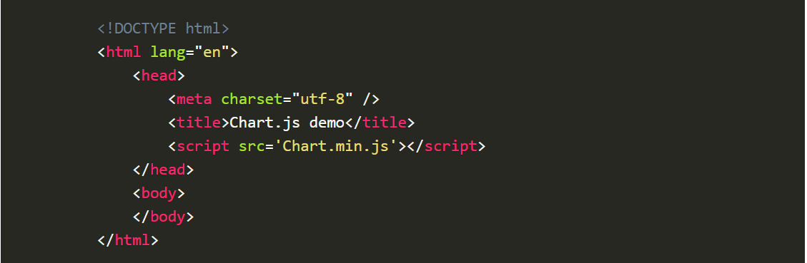
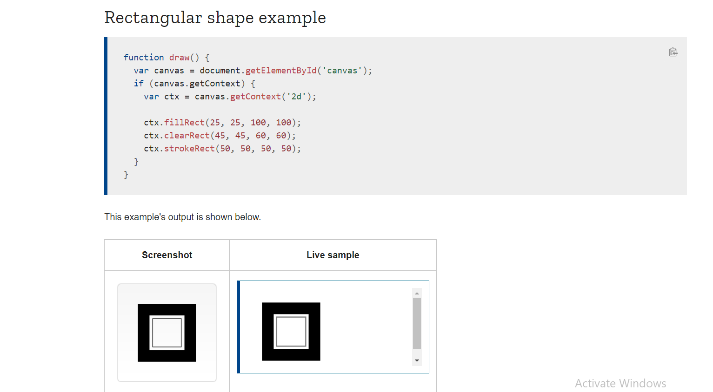

# **CHARTS.JS API**

- Charts is hte best way to represent a data.

- *Setting up charts:*
  1. Download Chart.js
  2. copy chart.min.js from the folder into the directory you'll be working with.

  3. Create new html page.
  4. Import the xcript.
   

- *Drawing a line chart*

1. Create a canvas element in html image.
2. Write a script that will retrieve the context of the canvas

## **Canvas Element**
* When your eyes cross the canvas element it will look like an image element but it has only two attributes height and width.

* For example if you want to draw a rectangle:
  