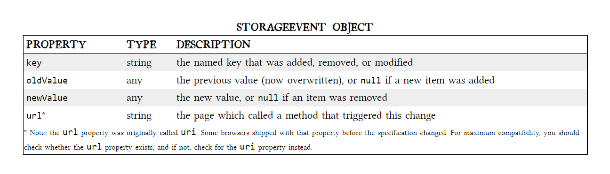

# **Local Storage**
- Before HTML5, the data of the applications were stored in something called *Cookies*(included in every server request)
- Web storage is more secure and have a large amounts of data that can be stored locally (without affecting website performance)

-HTML5 storage is based on key/value pairs, the key is considered as a string but the value can be any type of data

+ HTML web storage provides two objects for storing data:
    1. Window.local storage(No expiry date to the data stored)

   2. Session Storage: stores data for one session(you lose the data when closing the browser tab)

- These functions are used for localStorage (in JavaScript):
   * setItem()
   * getItem()
   * removeItem()
   * clear()
