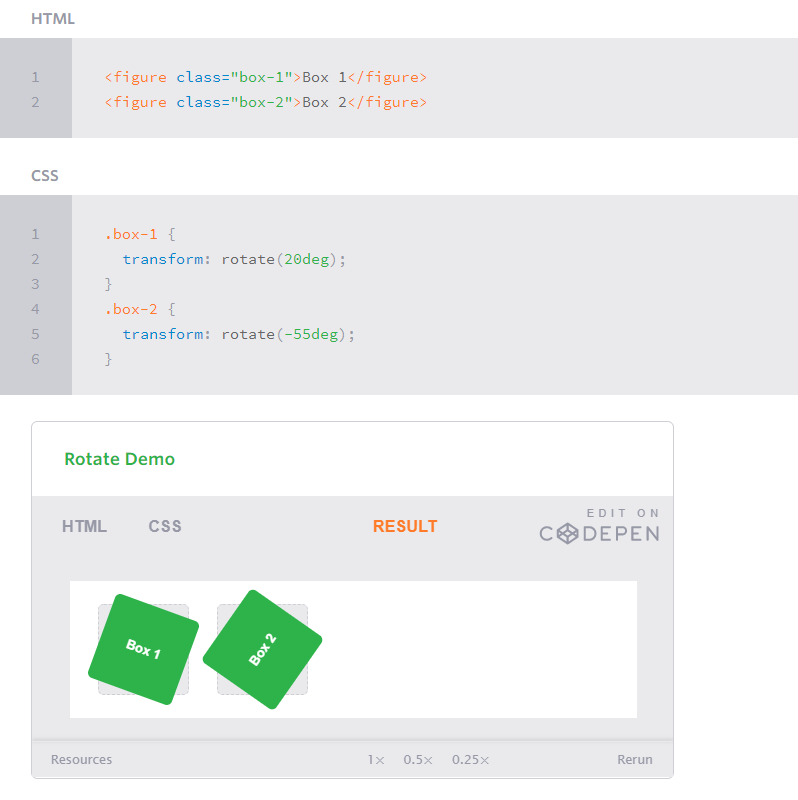

# **CSS Transforms, Transitions and Animations**

## **Tranforms**
- The transform property comes in 2 different settings:
   1. Two dimensional (2D)
   2. Three-dimencional (3D)

- Each one of these settings has its own properities and values
  

- Two-dimensional transforms work on x and y axes (Horizontal and vertical axes)
- Three-dimensional transforms work on both x and y axes also the z axis (length,width and depth)

  

## **Transitions and Animations**
* Front-end developers have been asking for how to make interaction within HTML and CSS without using the JavaScript

* Their dream come true by using CSS3 transitions and CSS3 animation.

* In transition you can alter the appearence and behavior of an element
* In animation it allows the appearence and behavior to be altered in multiple keyframes.
  