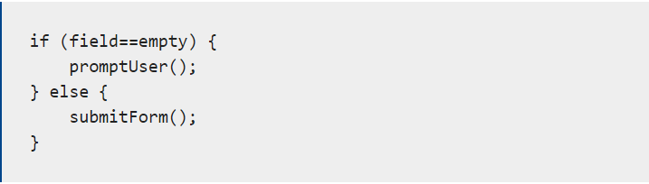
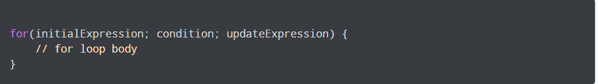

# **Control Flow**

## *Control flow: is an order which the computer EXCUTES statements in a script.*

- When we press on RUN the  code will directly run from first line until last line.

   UNLESS :
- The computer runs across the structure; this will result in changing the control flow
Example: 

1. Conditionals

2. Loops 

Example about condition:

Example about loops:

you can learn more about control flow from the [Link](https://developer.mozilla.org/en-US/docs/Glossary/Control_flow)
