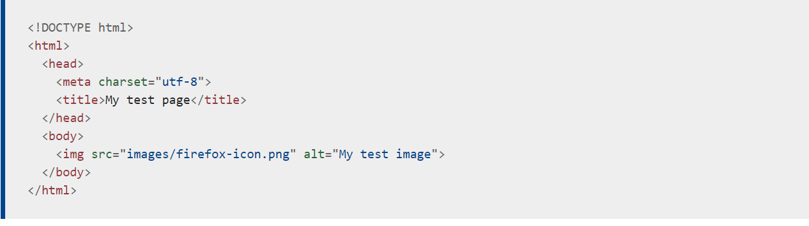

# **HTML**

## HTML : HyperText Markup Language (code we use it to structure a web page) for example paragraphs, list, images.

**HTML is represented by tags <> that's mean wraping the content**

Types of tags:

1. opening tags: <>
2. Closing tags <> </>
3. Self-closing tags </> : because no content in it example 

### Anatomy of HTML

## *Wireframes: Low fidelity sketch of a digital interface.*

**Types of Wireframes**:

1. Physical hand-drawn sketch.
2. Digital wireframes.

**To build a wireframe**:
- Sketch a basic rectangle ( it represents the basic of the screen)
- Sketch the main elements

**Free tools for wireframe**:
- Pen and paper
- Uxpin: High functionality
- In vision: to get a straight feedback from team and users
- Wireframe.cc: Provides the technology

**When building a wireframe you must have these points in your mind:

1. Clarity
2. Confidence
3. Simplicity

## **Semantic: means that a piece of code**

*Examples Semantic in HTML*

<h1>: is a semantic element

you can find another informations through thesse links

1. [link](https://careerfoundry.com/en/blog/ux-design/how-to-create-your-first-wireframe/#4-the-best-tools-for-wireframing)

2. [link1](https://developer.mozilla.org/en-US/docs/Learn/Getting_started_with_the_web/HTML_basics)

3.[link2](https://developer.mozilla.org/en-US/docs/Glossary/Semantics)

4.[link3](https://developer.mozilla.org/en-US/docs/Web/HTML)

