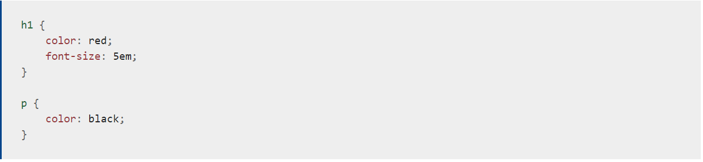

# CSS

## *CSS stands for Cascading Style Sheet, this language is responsible about styling or designing the webpage.*

 For example you can use CSS to change or add :
 - Color
 + Size
 * Link

 CSS stylsheet will contain many rules like :
  

 There is a 3 ways to add CSS :

 1. External CSS
 2. Internal CSS
 3. Inline CSS

 An example about  internal CSS:

