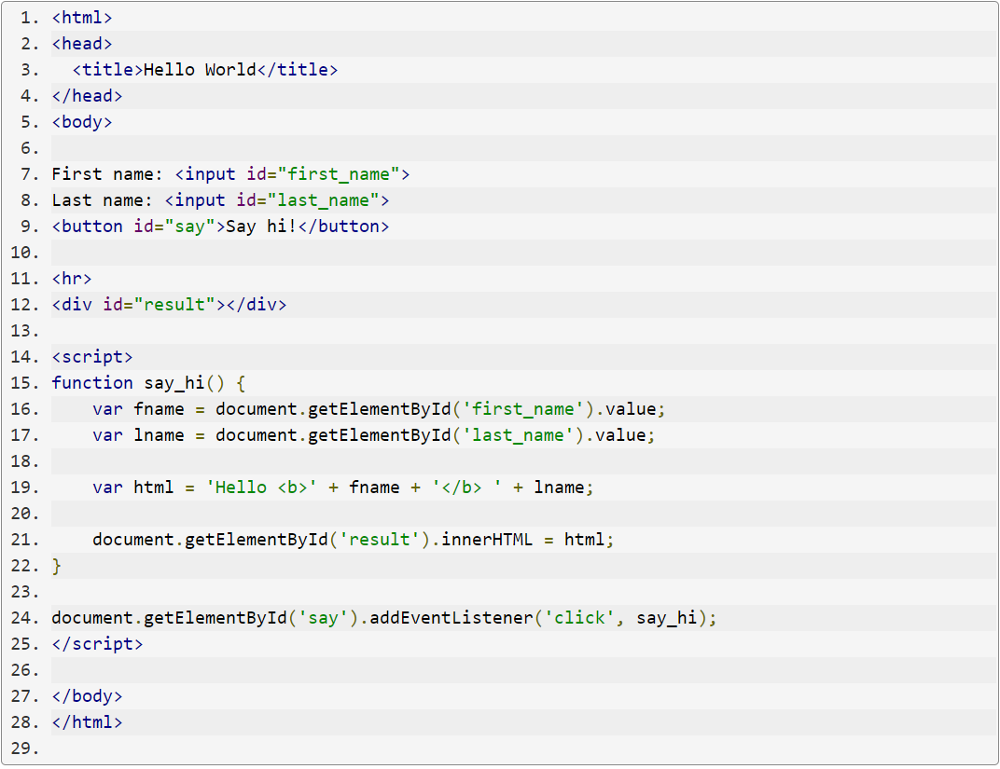

# **JavaScript**
## *JavaScript is a programming, scripting, and dynamic language.*

- We use it to make the webpage interactive with the users.

- We can find this language through the tag script, that it can be with the HTML file or another file and linked with HTML.

- It's not only used in webpages also in many non-browser environment like:
    1. Node.js 
    2. Adobe Acrobat

It has standards:
  - ECMAScript Language Specification.
  - ECMAScript Internationalization API.

### Example about JS:
  

#### In the words of Douglas Crockford:
>Computer programs are the most complex things that humans make.

 

