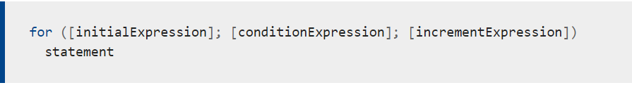
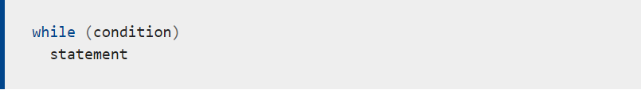

# Expression and operations
## *There are many operations that can be done in JavaScript like:*
1. Assignments operator: Assign value to variable
2. Arithmetic operators: Addition(+), Subtraction(-), Multiplication(*), Division (/), Increment(++), Decrement(--), Power off((**))

3. Comparison operator: Equalization *without caring about data type* (==) / (===) with caring about data type

4. Logical operators:
 And(&&), OR (||), NOT: (!)

# Loops:
## We have two types of loop: 
- For loop
- While loop 

### For loop : repeat code for limited  amount of times

### While loop : repeat the code many times (UNLIMITED)

